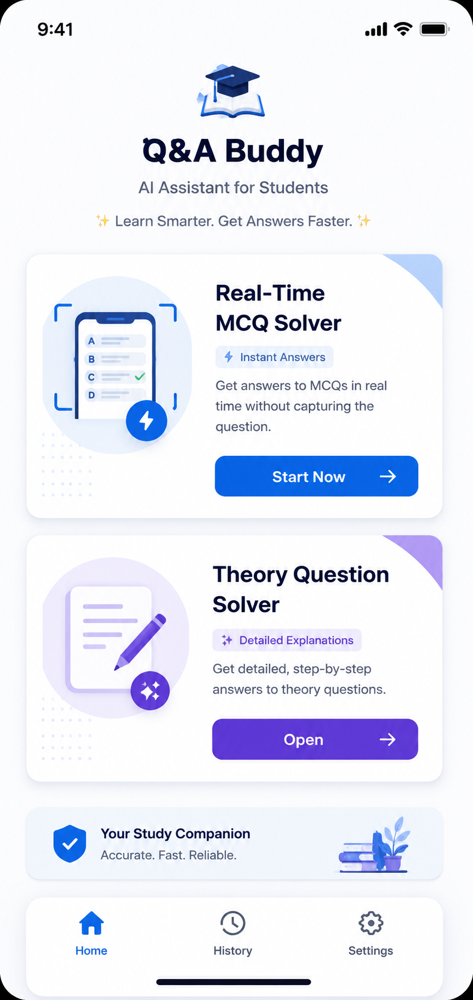
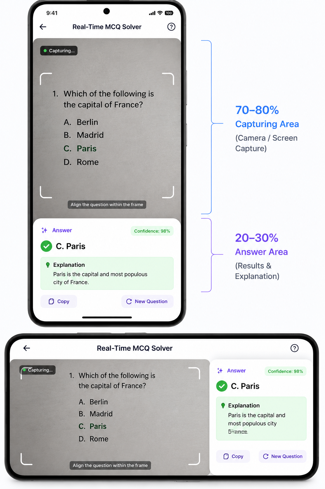
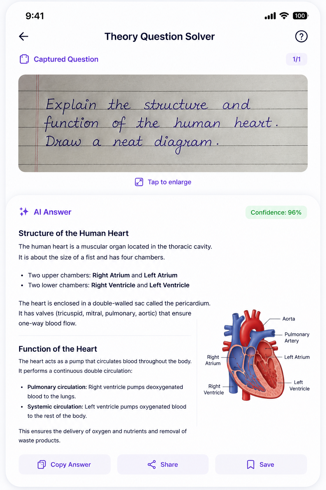

# AI Study Assistant - Project Specification

> **Purpose**
>
> This document explains the complete application, its purpose, navigation flow, UI, architecture, and expected behavior so an AI can analyze the project and divide it into Epics, Features, User Stories, Tasks, and Milestones.

---

# Project Overview

## Project Name

**AI Study Assistant**

---

## Description

AI Study Assistant is an Android application designed to help students answer examination questions quickly using Artificial Intelligence.

The application contains two primary modes:

1. **Real-Time MCQ Solver**
2. **Theory Question Solver**

The application should have a clean Material Design 3 interface with minimal navigation.

---

# Primary Goal

Help students obtain answers with the least number of taps.

The entire experience should feel:

* Fast
* Minimal
* Intelligent
* Real-time

---

# Main Navigation

```text
Splash Screen
      │
      ▼
Home Screen
      │
 ┌────┴───────────┐
 ▼                ▼
MCQ Solver    Theory Solver
```

---

# Application Flow

```text
Open App
      │
      ▼
Home Screen
      │
      ├──────────────► Real-Time MCQ Solver
      │
      └──────────────► Theory Question Solver
```

---

# Screen 1

## Home Screen

This is the first screen users see.

The UI contains only two large cards.

---

## Layout

```
------------------------------------

          AI Study Assistant

------------------------------------

📷 Real-Time MCQ Solver

Reads MCQs in real time

[ Start ]

------------------------------------

📝 Theory Question Solver

Capture theory questions

[ Open ]

------------------------------------
```

---

## Image Placeholder

```
[IMAGE HERE]

Home Screen Mockup
```

---

# Feature 1

# Real-Time MCQ Solver

---

## Purpose

Read MCQs directly from the user's screen or live capture.

The user should **NOT** take screenshots manually.

The app continuously processes the visible question.

---

# User Flow

```text
Home
    │
    ▼
MCQ Solver
    │
Permission Screen
    │
Accessibility Service
    │
Screen Capture Permission
    │
Start Capturing
    │
AI Detects Question
    │
Answer Appears
```

---

# Portrait Layout

The portrait layout is divided vertically.

Approximately

* 70–80% → Capture Area
* 20–30% → Answer Area

```
--------------------------------------

Capture Area

(Screen Preview)

70-80%

--------------------------------------

Answer

Option C

Explanation

Confidence

--------------------------------------
```

---

## Image Placeholder

```
[IMAGE HERE]

Portrait MCQ Solver
```

---

# Landscape Layout

Landscape uses the same concept.

```
--------------------------------------

Capture Area        Answer Area

70%                 30%

--------------------------------------
```

---

## Image Placeholder

```
[IMAGE HERE]

Landscape MCQ Solver
```

---

# MCQ Answer Card

The bottom answer card displays

* Correct Option
* Confidence
* Small explanation
* Copy button

Example

```
Answer

✅ Option C

Confidence

98%

Explanation

Paris is the capital of France.
```

---

# Feature 2

# Theory Question Solver

---

## Purpose

Answer descriptive questions captured from images.

The AI generates complete, structured answers.

---

# User Flow

```text
Home
    │
Theory Solver
    │
Camera
    │
Capture Question
    │
Image Processing
    │
OCR
    │
AI Generates Answer
    │
Display Response
```

---

# Layout

The screen is divided vertically.

Top

20%

Displays captured image.

Bottom

80%

Displays AI-generated response.

```
--------------------------------------

Question Image

20%

--------------------------------------

Answer

80%

--------------------------------------
```

---

## Image Placeholder

```
[IMAGE HERE]

Theory Solver Screen
```

---

# Theory Answer Layout

The generated answer should include

* Title
* Structured explanation
* Bullet points
* Steps (if applicable)
* Diagrams (when relevant)
* Summary

Example

```
Human Heart

Definition

Structure

Functions

Diagram

Summary
```

---

# User Actions

The answer screen should support

* Copy Answer
* Share
* Save
* Ask Again

---

# Permissions

The application requires

## Camera

Capture theory questions.

---

## Screen Capture

Capture live MCQs.

---

## Accessibility Service

Observe the screen in real time.

---

## Internet

Communicate with AI backend.

---

# Design Guidelines

Material Design 3

Minimal

Rounded corners

Modern typography

Light theme

Large touch targets

Soft shadows

---

# Suggested Color Palette

Primary

Blue

Secondary

Purple

Background

White

Surface

Light Gray

Success

Green

Error

Red

---

# Suggested Typography

Screen Title

28sp

Card Title

20sp

Body

16sp

Caption

14sp

Buttons

16sp

---

# AI Processing Pipeline

## MCQ Mode

```text
Live Screen

↓

OCR

↓

Extract Question

↓

Extract Options

↓

AI Analysis

↓

Answer

↓

Confidence

↓

Display
```

---

## Theory Mode

```text
Image

↓

OCR

↓

Extract Text

↓

Prompt Builder

↓

AI

↓

Formatted Response

↓

Display
```

---

# Suggested Architecture

```text
Presentation Layer

↓

ViewModel

↓

Repository

↓

AI Service

↓

OCR Service

↓

Storage
```

---

# Screens

1. Splash Screen
2. Home Screen
3. Permission Screen
4. MCQ Solver
5. Theory Solver
6. Settings
7. History (Optional)

---

# Future Features

* Offline OCR
* Multiple AI models
* Multi-language support
* Voice answers
* Dark mode
* Save notes
* Favorites
* Export to PDF
* Cloud sync
* Search history

---

# Functional Requirements

## Home

* Display two primary features.
* Navigate to selected feature.

---

## MCQ Solver

* Request permissions.
* Start live capture.
* Detect questions automatically.
* Show answer instantly.
* Update continuously.
* Display confidence score.

---

## Theory Solver

* Capture image.
* Extract question.
* Generate detailed answer.
* Allow copy/share/save.
* Support long responses.

---

# Non-Functional Requirements

* Fast response time
* Responsive UI
* Minimal battery usage
* Smooth animations
* Clean architecture
* Modular codebase
* Easy maintenance
* Scalable feature design

---

# Deliverables for AI Planning

When analyzing this project, the AI should divide it into:

1. Epics
2. Features
3. User Stories
4. Tasks
5. Technical Tasks
6. UI Components
7. Navigation
8. Database (if needed)
9. API Layer
10. State Management
11. Testing Strategy
12. Milestones
13. Sprint Plan

The output should be organized so that each story is independently implementable and can be assigned to a developer without ambiguity.

---

# Image Placeholders


Home Screen


 MCQ Solver


Theory Question Solver

